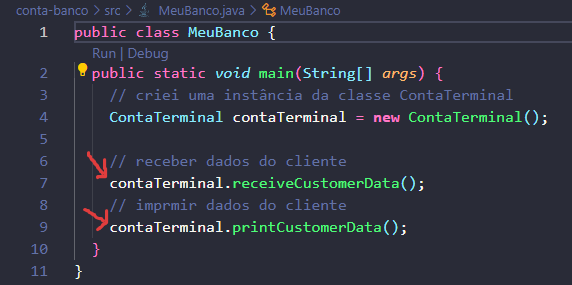

### DIO, Bootcamp Santander - Java backened - 2023

# Projeto - ContaBanco
É um projeto que visa por em prática, os conceitos que aprendemos neste primeiro
momento do curso.
- [x] Amatomia das classes
- [x] Padrão de nomenclatura de: classes, métodos e váriáeis
- [x] Tipos e variáveis
- [x] Operadores
- [x] Métodos
- [x] Escopo
- [x] Palavras reservadas
- [x] Documentação 

#### Idealizador do projeto
- [Gleyson Sampaio](https://github.com/glysns)

## Sintaxe do desafio Desafio
- link: https://github.com/digitalinnovationone/trilha-java-basico/tree/main/desafios/sintaxe
<hr/>

## Projeto 

### Nome das Classes
```
para nomear as classes, segui o padrão em portugûes, conforme o proposto no projeto,
mas, para os métodos e varíaveis, utilizei o inglês.
```
**Estrutura do Projeto**
```
Dividi em duas partes, criei a classe principal chamada MeuBanco, que chama os métodos
necessários para realizar a coleta dos dados e a impressão, estes métodos estão contidos
na classe ContaTerminal.  
```

**Imagem de MeuBanco**



## Detalhes Gerais

- utilizei a classe Scanner para poder coletar os dados do cliente,
  mas observei que não tinha como digitar um nome completo com apenas
  (next), fiz uma pesquisa e vi que posso utilizar o (nextLine) que
  permite capturar uma linha inteira.
  
  ```Java
      System.out.println("Digite seu nome:");
      nameCustomer = keyboard.nextLine();
  ```
- Procurei utilizar todos recuros apresentados durante este módulo,
  mas sem exagerar e deixar o código feio ou confuso.

### Pessoas Desenvolvedoras
<br/>
<b>Bart Silva</b><br/>
<b>Linkedin: </b>
https://www.linkedin.com/in/bart-silva-br/

### Minhas considerações
Entendo que é um projeto apenas para praticar o que foi mostrado nessa etapa do curso, já que criar contas nesse contexto 
é algo que não vai existir no mundo real, claro que, se o objetivo deste código for ir evoluindo a ideia ao longo do curso,
ai sim vai ser show.


